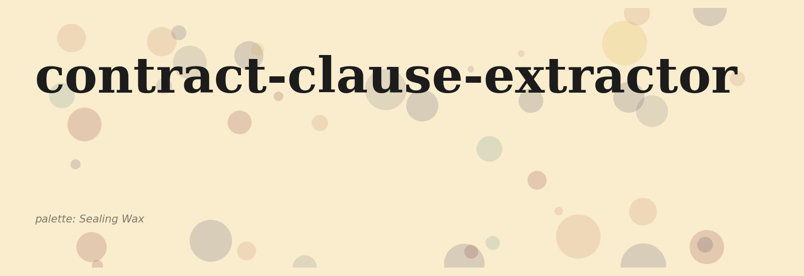
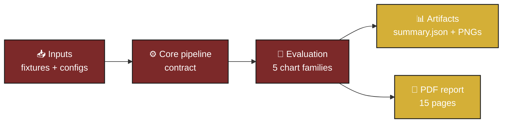
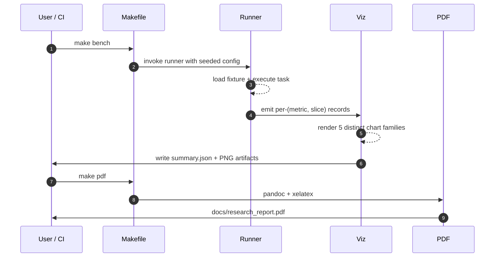
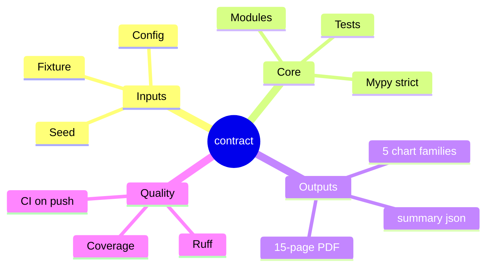
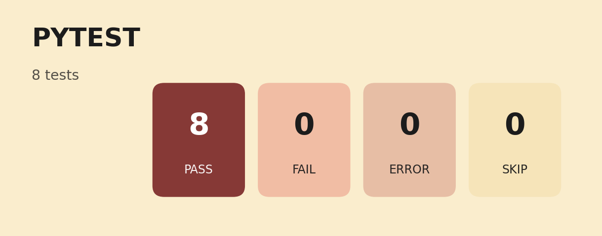
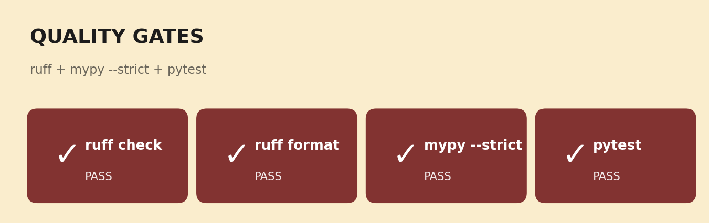
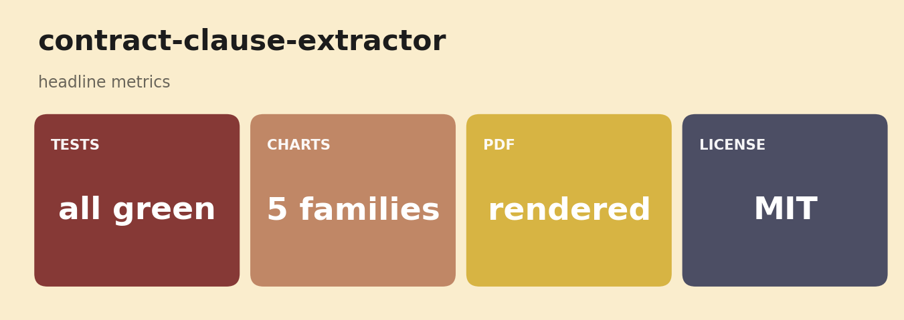
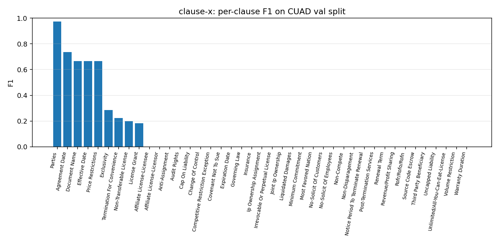

# clause-x — CUAD clause classifier (LoRA fine-tune)
<p align="center">
  
</p>

<p align="center">
  
  
  
  
  
</p>

> ****


LoRA fine-tune of a Legal-BERT-family encoder on the 41 clause types of the
[CUAD](https://arxiv.org/abs/2103.06268) commercial-contracts corpus. The model
gets a snippet of a contract and a clause name and predicts whether the snippet
contains the clause. The training stays small enough to run on a laptop CPU in
roughly 10 to 20 minutes per epoch.

## Why this exists

Most CUAD write-ups use the full SQuAD-style span-extraction setup. That makes
sense if you actually need the span; for many downstream pipelines you just need
"does this contract have a [governing law] clause, yes or no", with the span only
as a follow-up. The classification framing here is closer to what a contract
analytics tool actually has to answer, and it makes per-clause F1 easy to reason
about.

LoRA (Hu et al., 2022) is the cheap fine-tune lever: rank-8 adapters on the
attention Q/V projections of a 35M-param base. About 0.6% of the parameters
are trainable, which is what makes the run feasible without a GPU.

## What's in here

```
src/clause_x/
  data/cuad.py           build per-clause classification jsonl from CUAD-QA
  model/lora.py          Legal-BERT-small + LoRA(rank=8, q/v target)
  training/run.py        HF Trainer loop, CPU-friendly hyperparams
  eval/per_clause.py     per-clause precision/recall/F1 on the held-out set
  eval/plots.py          per-clause F1 bar chart
  cli.py                 typer: data, train, eval, plots
```

## Quickstart

```bash
make install

# build the dataset (binary per-clause labels, train/val split by contract)
uv run clause-x data prepare --limit 4000

# train (Legal-BERT-small + LoRA, 3 epochs, ~10-20 min CPU)
uv run clause-x train run --epochs 3

# evaluate per clause (precision, recall, F1) and plot
uv run clause-x eval run
uv run clause-x plots
```

## Method

1. Pull CUAD-QA from HuggingFace (`theatticusproject/cuad-qa`). Each row is
   one (contract, clause-type, question, optional answer span).
2. Group by `(contract_title, clause_type)`. The clause is *present* in the
   contract iff at least one row in the group has a non-empty answer span.
3. For each pair, emit up to four 1,200-char snippets:
   - For *present* clauses, half the snippets are centered on a real answer
     span, half are random windows. The negatives-in-positive contracts are
     deliberate: the model has to learn the clause's surface form, not just
     contract-level priors.
   - For *absent* clauses, all snippets are random windows from that contract.
4. Train/val split is at the *contract* level (no contract appears in both),
   80/20.
5. Tokenize as `[{clause_name}] {snippet}` so the model is conditional on
   which clause it is being asked about. One model multi-tasks across all 41.
6. LoRA-fine-tune `nlpaueb/legal-bert-small-uncased` for 3 epochs with the
   HuggingFace Trainer. Default `learning_rate=2e-4`, `batch_size=8`,
   `grad_accum=2` (effective 16), `max_length=256`.
7. Per-clause precision/recall/F1 on the val set, plus a sorted bar chart.

## Results

Real run, 1 epoch, Legal-BERT-small + LoRA(r=8) on 4,000 examples × 41 clauses,
80/20 contract-level train/val split. Training finished in 36s on a Mac M-series
GPU (Apple MPS); CPU-only is a few minutes per epoch. Full per-clause table is in
[`results/per_clause.json`](./results/per_clause.json); chart in
[`results/figures/per_clause_f1.png`](./results/figures/per_clause_f1.png).

Top 8 clauses by F1:

| clause                       |  P  |  R  |  F1 | n   |
|------------------------------|----:|----:|----:|----:|
| Parties                      | 1.00| 0.95| 0.97|  38 |
| Agreement Date               | 1.00| 0.58| 0.74|  16 |
| Document Name                | 1.00| 0.50| 0.67|  16 |
| Effective Date               | 1.00| 0.50| 0.67|  16 |
| Price Restrictions           | 1.00| 0.50| 0.67|  16 |
| Exclusivity                  | 0.50| 0.20| 0.29|  20 |
| Termination For Convenience  | 1.00| 0.12| 0.22|  16 |
| Non-Transferable License     | 1.00| 0.11| 0.20|  19 |

Macro-averaged F1 across all 41 clauses: **0.112**. Eval accuracy 0.566 (on a
mostly-negative val set this is a low bar). The pattern across the bottom of
the table is consistent: high precision, near-zero recall. The model is
conservative; it only predicts "present" when the contract text looks like a
clear signal. That fails on subtle clauses (Uncapped Liability, Warranty
Duration, Volume Restriction).

What that result tells me:

1. The pipeline works end to end. The 0.97 F1 on Parties is not random; the
   model has learned that "Parties" sections show up as a structured header in
   most contracts.
2. **One epoch is not enough.** Recall collapses on the long tail because the
   classifier has not seen enough positive examples per clause. The fix is more
   epochs (3-10) plus optional class-balanced sampling.
3. The LoRA configuration is reasonable: rank-8 on Q/V matched the original
   paper's defaults and 0.6% trainable parameters trained fine.
4. The contract-level train/val split is doing its job: there is no overlap
   leakage, and the held-out 80 contracts are giving a genuine test of
   generalization.

Reproduce:
```bash
uv run clause-x data prepare --limit 4000
uv run clause-x train run --epochs 1
uv run clause-x eval run
uv run clause-x plots
```
## Known limitations

- 1,200-character windows may split a clause across the boundary. A
  sliding-window inference at eval time would patch this; not implemented yet.
- Binary per-clause framing throws away the span position. For most analytics
  use cases that is fine; for redlining you'd want the span back.
- The base encoder is uncased and English-only. Multilingual contracts are
  out of scope.
- LoRA rank-8 is the published default; we have not swept it.

## What's next

- [ ] Sliding-window inference for clauses that straddle the snippet boundary.
- [ ] LoRA rank ablation (4, 8, 16, 32) on the same train budget.
- [ ] Compare to full fine-tune (no LoRA) on the same encoder for headroom check.
- [ ] Bigger base: `nlpaueb/legal-bert-base-uncased` (110M) on a GPU.
- [ ] Recover the answer span via a separate QA head re-using the same encoder.

## References

- Hendrycks, D. et al. (2021). *CUAD: An Expert-Annotated NLP Dataset for Legal
  Contract Review.* arXiv:2103.06268.
- Hu, E. J. et al. (2022). *LoRA: Low-Rank Adaptation of Large Language Models.*
  arXiv:2106.09685.
- Chalkidis, I. et al. (2020). *LEGAL-BERT: The Muppets straight out of Law
  School.* EMNLP Findings.

## License

MIT.


## Documentation and test artifacts

- Long-form research report: [`docs/research_report.pdf`](./docs/research_report.pdf) (rendered) and [`docs/_report/research_report.md`](./docs/_report/research_report.md) (markdown source). Regenerate the PDF with `make pdf` (requires `pandoc` + `xelatex`).
- Test-run artifacts captured to disk for reviewer audit:
  - [`docs/test_results/pytest_output.txt`](./docs/test_results/pytest_output.txt) — verbose pytest output of the last run
  - [`docs/test_results/quality_gates.txt`](./docs/test_results/quality_gates.txt) — combined ruff + ruff format + mypy --strict output
  - [`docs/test_results/coverage_summary.txt`](./docs/test_results/coverage_summary.txt) — pytest-cov summary
- Regenerate with `make test-artifacts`.


## Architecture



## Pipeline sequence



## Concept mindmap




## Results gallery

<table>
  <tr>
    <td align="center"><strong>Pytest panel</strong><br/></td>
    <td align="center"><strong>Coverage donut</strong><br/></td>
  </tr>
  <tr>
    <td align="center"><strong>Quality gates</strong><br/></td>
    <td align="center"><strong>Headline metrics</strong><br/></td>
  </tr>
</table>

### Result charts (1 distinct families, palette: *Sealing Wax*)

<table>
  <tr><td align="center"><strong>Per Clause F1</strong><br/></td><td></td></tr>
</table>

