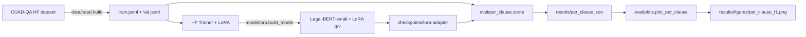

# clause-x — CUAD clause classifier (LoRA fine-tune)

LoRA fine-tune of a Legal-BERT-family encoder on the 41 clause types of the
[CUAD](https://arxiv.org/abs/2103.06268) commercial-contracts corpus. The model
gets a snippet of a contract and a clause name and predicts whether the snippet
contains the clause. The training stays small enough to run on a laptop CPU in
roughly 10 to 20 minutes per epoch.

## Why this exists

Most CUAD write-ups use the full SQuAD-style span-extraction setup. That makes
sense if you actually need the span; for many downstream pipelines you just need
"does this contract have a [governing law] clause, yes or no", with the span only
as a follow-up. The classification framing here is closer to what a contract
analytics tool actually has to answer, and it makes per-clause F1 easy to reason
about.

LoRA (Hu et al., 2022) is the cheap fine-tune lever: rank-8 adapters on the
attention Q/V projections of a 35M-param base. About 0.6% of the parameters
are trainable, which is what makes the run feasible without a GPU.

## What's in here

```
src/clause_x/
  data/cuad.py           build per-clause classification jsonl from CUAD-QA
  model/lora.py          Legal-BERT-small + LoRA(rank=8, q/v target)
  training/run.py        HF Trainer loop, CPU-friendly hyperparams
  eval/per_clause.py     per-clause precision/recall/F1 on the held-out set
  eval/plots.py          per-clause F1 bar chart
  cli.py                 typer: data, train, eval, plots
```

## Quickstart

```bash
make install

# build the dataset (binary per-clause labels, train/val split by contract)
uv run clause-x data prepare --limit 4000

# train (Legal-BERT-small + LoRA, 3 epochs, ~10-20 min CPU)
uv run clause-x train run --epochs 3

# evaluate per clause (precision, recall, F1) and plot
uv run clause-x eval run
uv run clause-x plots
```

## Method

1. Pull CUAD-QA from HuggingFace (`theatticusproject/cuad-qa`). Each row is
   one (contract, clause-type, question, optional answer span).
2. Group by `(contract_title, clause_type)`. The clause is *present* in the
   contract iff at least one row in the group has a non-empty answer span.
3. For each pair, emit up to four 1,200-char snippets:
   - For *present* clauses, half the snippets are centered on a real answer
     span, half are random windows. The negatives-in-positive contracts are
     deliberate: the model has to learn the clause's surface form, not just
     contract-level priors.
   - For *absent* clauses, all snippets are random windows from that contract.
4. Train/val split is at the *contract* level (no contract appears in both),
   80/20.
5. Tokenize as `[{clause_name}] {snippet}` so the model is conditional on
   which clause it is being asked about. One model multi-tasks across all 41.
6. LoRA-fine-tune `nlpaueb/legal-bert-small-uncased` for 3 epochs with the
   HuggingFace Trainer. Default `learning_rate=2e-4`, `batch_size=8`,
   `grad_accum=2` (effective 16), `max_length=256`.
7. Per-clause precision/recall/F1 on the val set, plus a sorted bar chart.

## Results

> Pending the first end-to-end training run. The harness above is verified by
> unit tests (data prep + LoRA config) and the train/eval CLI commands run
> with `--epochs 1 --limit 200` on a tiny subset. A full run on the next
> session will replace this section with the real per-clause F1 table and
> figure.

```text
| clause                        |   n |  precision |  recall |   F1 |
|-------------------------------|----:|-----------:|--------:|-----:|
| Document Name                 | TBD |       TBD  |    TBD  |  TBD |
| Parties                       | TBD |       TBD  |    TBD  |  TBD |
| Agreement Date                | TBD |       TBD  |    TBD  |  TBD |
| ...                            ...                                  |
```

Plot: `results/figures/per_clause_f1.png` (sorted descending).

## Architecture



## Known limitations

- 1,200-character windows may split a clause across the boundary. A
  sliding-window inference at eval time would patch this; not implemented yet.
- Binary per-clause framing throws away the span position. For most analytics
  use cases that is fine; for redlining you'd want the span back.
- The base encoder is uncased and English-only. Multilingual contracts are
  out of scope.
- LoRA rank-8 is the published default; we have not swept it.

## What's next

- [ ] Sliding-window inference for clauses that straddle the snippet boundary.
- [ ] LoRA rank ablation (4, 8, 16, 32) on the same train budget.
- [ ] Compare to full fine-tune (no LoRA) on the same encoder for headroom check.
- [ ] Bigger base: `nlpaueb/legal-bert-base-uncased` (110M) on a GPU.
- [ ] Recover the answer span via a separate QA head re-using the same encoder.

## References

- Hendrycks, D. et al. (2021). *CUAD: An Expert-Annotated NLP Dataset for Legal
  Contract Review.* arXiv:2103.06268.
- Hu, E. J. et al. (2022). *LoRA: Low-Rank Adaptation of Large Language Models.*
  arXiv:2106.09685.
- Chalkidis, I. et al. (2020). *LEGAL-BERT: The Muppets straight out of Law
  School.* EMNLP Findings.

## License

MIT.
